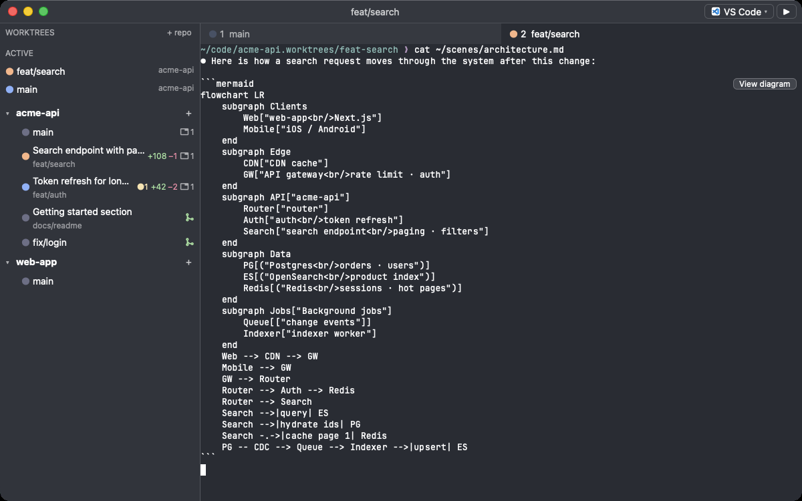
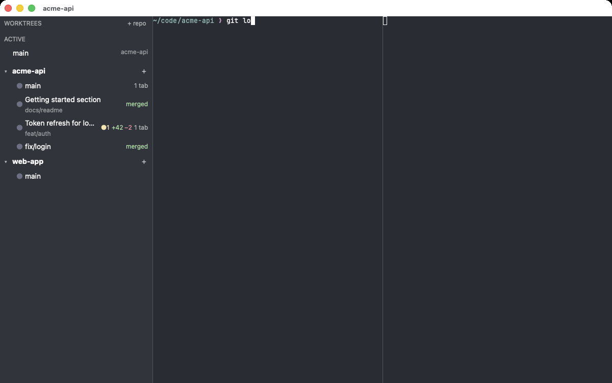
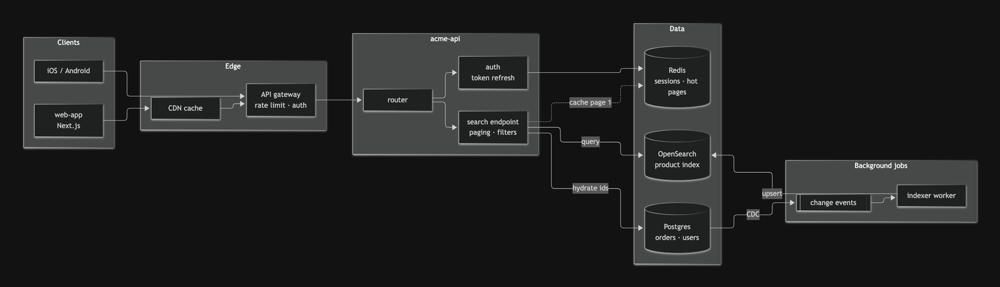
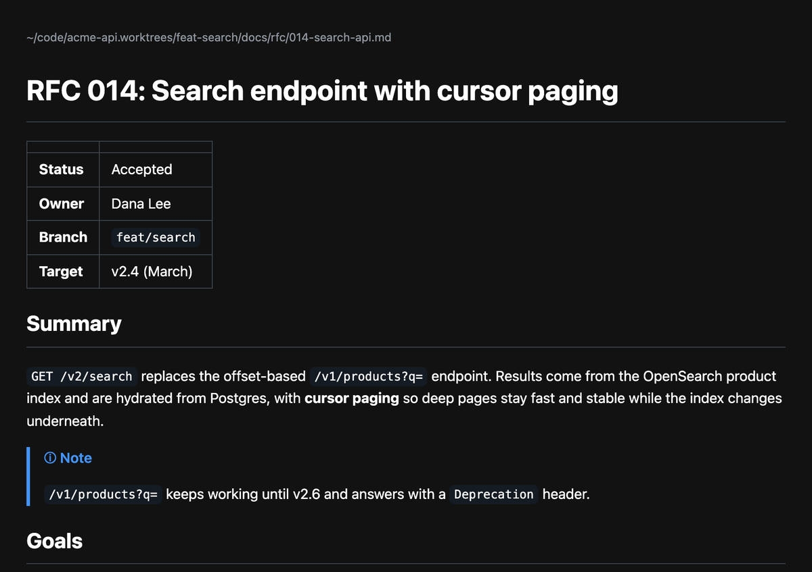
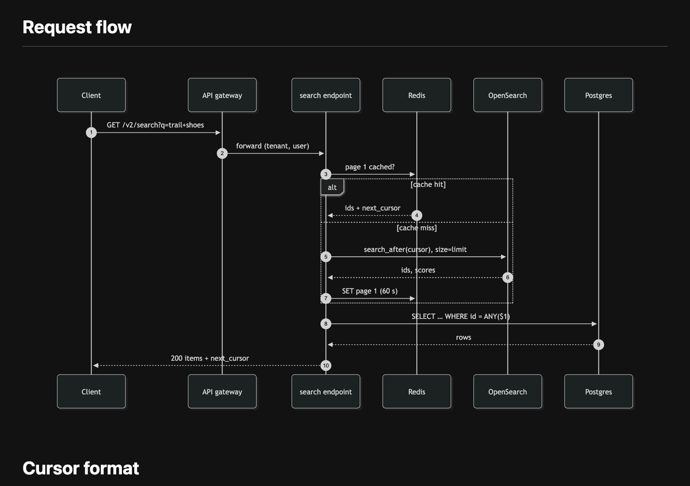
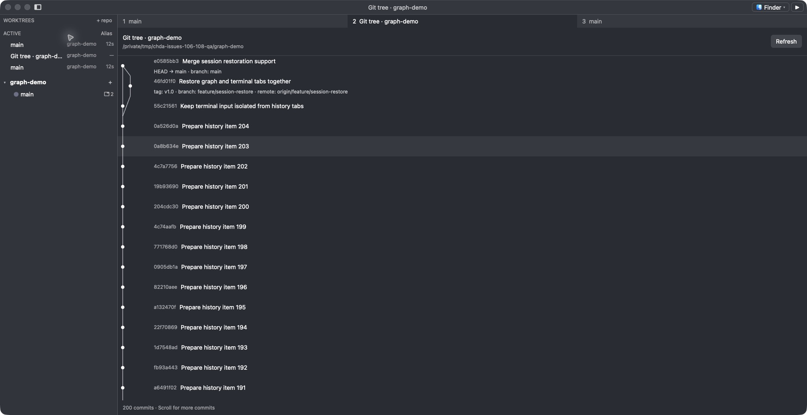
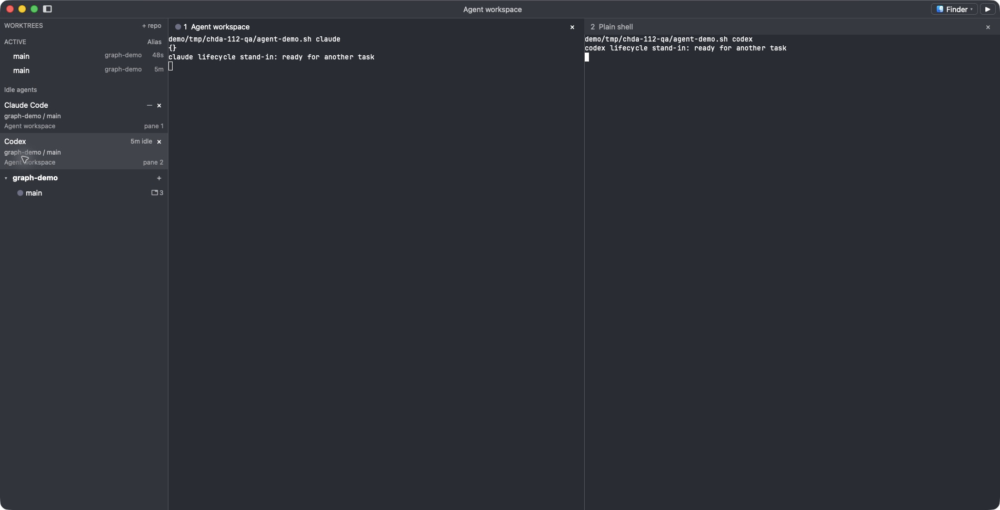

<p align="center">
  
</p>

<h1 align="center">chda</h1>

<p align="center"><i>chda</i> is pronounced <b>CHE-DA</b> (IPA: <b>/ˈtʃɛ.dɑː/</b>): "ch" as in <i>chair</i>, "e" as in <i>bed</i>, then "dah".</p>

<p align="center"><b>Checkout · Hack · Deliver · Again.</b><br>
A terminal with a git worktree sidebar and a live status board for coding agents:<br>
Claude Code, Codex, Gemini CLI, GitHub Copilot CLI and OpenCode.</p>

<p align="center">
  <a href="https://github.com/magicsih/chda/releases/latest"></a>
  <a href="https://github.com/magicsih/chda/actions/workflows/ci.yml"></a>
  
  <a href="LICENSE"></a>
</p>

## Why a worktree terminal

One worktree, one task, one agent. Coding agents such as Claude Code and Codex are
most productive when each runs in its own git worktree, but a normal terminal leaves
you mapping tabs to worktrees in your head. chda puts that map in a sidebar: which
worktree is running which agent, which one is waiting for your answer, which one is
finished and unread. Creating a worktree, launching the agent, merging the branch and
cleaning up all happen from the same panel, without leaving the terminal.

The terminal core is [libghostty-vt](https://github.com/ghostty-org/ghostty), so
escape sequences, Unicode and key encoding behave like Ghostty. The app is Rust on
[GPUI](https://github.com/zed-industries/zed/tree/main/crates/gpui).

## Install

```sh
brew tap magicsih/tap
brew trust magicsih/tap
brew install --cask chda
```

Or download `chda-<version>-macos-universal.zip` from the
[releases page](https://github.com/magicsih/chda/releases). The app is signed and
notarized.

Requirements: macOS 14 or newer (Apple silicon or Intel), `git` on `PATH`. `gh` is optional
and adds pull request badges. On a managed Mac where Homebrew cannot write to
`/Applications`, add `--appdir=~/Applications`.

## Sixty-second tour

<p align="center">
  
</p>

1. Press `cmd-shift-o` (or click "+ repo") and pick a git repository. It appears in
   the sidebar with its worktrees. A folder that is not a repository can be
   initialized with `git init` on the spot or added as a plain folder: one row
   for terminals and agents, without git badges or worktrees.
2. Click "+" next to the repository, type a branch name (or leave it empty for a
   random one like `brisk-otter`), and optionally a note saying what the task is,
   then press Enter. chda creates `<repo>.worktrees/<branch>` and opens a tab
   there; the note becomes the row's label. To stack work on another branch,
   right-click its worktree and choose "New worktree from this branch..."
3. Right-click the worktree and choose "Run Claude Code" or "Run Codex". The agent
   starts in that worktree with chda's hooks attached. Gemini CLI, Copilot CLI
   and OpenCode join the menu through `agents` in `config.toml`, and your usual
   flags through `[[agent-presets]]`. You can also type `codex` directly in a
   chda zsh, bash or fish terminal with shell integration enabled; its status
   is tracked too.
4. Watch the dot next to the branch:

   | Dot | Meaning |
   |---|---|
   | grey | idle |
   | blue | working |
   | orange | waiting for your input (you also get a notification) |
   | green | finished; clears when you look at the tab |

5. When the branch is done, click its `+12 −3` badge to read the diff in a tab,
   then right-click it and choose "Merge into main and clean up". chda merges,
   removes the worktree and deletes the branch, and refuses when there are
   uncommitted changes, unpushed commits or an open pull request.

## Diagrams and Markdown, rendered offline

Agents answer with Mermaid diagrams and write design docs in Markdown. chda
finds Mermaid in a pane's output ("View diagram" on the block, or "View last
diagram" in the palette) and previews Markdown files (right-click a `.md` path,
or "Preview Markdown" in the palette). Both open as local pages in your
browser: nothing is uploaded, remote content is blocked and scripts in the
document do not run. Mermaid blocks inside Markdown become diagrams too.

<p align="center">
  
</p>
<p align="center">
  
  
</p>

## Features

<!-- BEGIN GENERATED FEATURES -->
| Area | What you get |
|---|---|
| Terminal | Ghostty-accurate VT handling, true color, minimum text contrast of 3 by default (Ghostty `minimum-contrast` from 1 to 21; 1 disables adjustment), readable text even when a running agent retains its prompt background across a theme change, wide glyphs, IME input, mouse selection and reporting, scrollback search (`cmd-f`), cmd-click links and file paths, including space-containing parenthesized paths across soft-wrapped rows, right-click actions on paths (reveal in Finder, open a tab or `cd` there, copy), drag and drop paths, inline images (Kitty graphics protocol), Mermaid diagrams in agent output rendered offline ("View diagram"), Markdown files previewed in the browser (right-click a `.md` path, or "Preview Markdown" in the palette), font size shortcuts, prompt jumping (`cmd-up` / `cmd-down`) |
| Tabs and splits | Open another window with cmd-shift-n. Windows, terminal and Git tree tabs, splits, active focus, directories and exact supported agent conversations come back after restart. Previous working activity remains available separately from new runtime output. Every tab has a visible close button, including long labels and inactive tabs; cmd-w closes the focused pane. Working or waiting agents ask before stopping. |
| App updates | In a configured, signed macOS release, click Update to download, verify and install with Sparkle. Progress is shared across windows; installation waits for current repository tasks and unfinished input before preserving sessions. macOS asks for administrator approval when required. Windows briefly reopen while running shells and agents, terminal text and scrollback, pane IDs, layouts and focus reconnect. Failed installation or startup reopens the retained signed app with the same sessions. Terminals that have used inline images block the update without stopping their processes. Release notes and version dismissal remain separate; automatic downloads and installs are off. v0.1.19 requires one manual update first. |
| Title bar | The focused pane's repository and branch-note alias appear as repo - task; the branch is the fallback. Custom tab names remain on tabs without hiding the repository context. Hover for the repository, full note, branch and worktree path. Open the focused worktree in a chosen installed editor or Finder. |
| Notifications | The title-bar notification control stays immediately before the installed-app picker, even with the sidebar hidden or no available picker. Window-local history lists severity, date and UTC time, message and known directory/tab/pane context newest first. Opening reads only existing arrivals; later arrivals remain unread. Selecting an agent event goes to its exact still-open pane. Operational errors and successes no longer overwrite a single sidebar message; an ongoing branch update changes one entry. OS notifications and provider usage controls remain available. History retains at most 500 entries and reports removed older entries. Normal restart clears it; session-preserving updates retain each window's history and read state. |
| Sidebar | Repositories and plain folders, worktrees, dirty / ahead / behind / conflict badges, lines added and removed against the default branch (click for a read-only diff tab), pull request state via `gh`, `glab` or `tea`, open-tab counts, an ACTIVE list with live agent tabs before ordinary terminal tabs, stable tab order within each group and a direct close button on ordinary terminals with time since last terminal activity and an alias / branch-name toggle. ACTIVE, IDLE and PROJECT are peer sections and collapse independently, show their counts while collapsed, and remember the choice across restarts. IDLE lists live agents ready for another prompt with their repository, branch, tab and pane; click to focus or close that pane. Every badge explains itself on hover. Repositories and folders, including STARRED branches, sit beneath PROJECT; use the individual repository disclosures. Drag a repository header above or below another to reorder the list; a line marks where it lands, the list scrolls near its edges, and the order is saved without moving folders or changing Git. Right-click a branch and choose "Add to Starred" to keep it in a STARRED list within PROJECT, per repository and saved across restarts; click a starred row to go to its worktree, or its star to unstar it without leaving the current tab. Navigation highlights the exact ACTIVE tab and scrolls only enough to reveal a clipped worktree while keeping its repository context visible without stealing terminal keyboard focus. ACTIVE branch labels update immediately when focus changes between split panes; background updates preserve deliberate collapse. Selecting a worktree reuses its most recently focused pane across windows. A working agent shows a spinning ring, an agent waiting for input an orange "!" badge on a tinted row, a finished turn a green dot, a live idle agent a yellow dot and a row with no live agent a gray dot. |
| Worktrees | Create from a new or existing branch, delete with a safety check, merge-and-clean, bulk cleanup of merged branches, update a branch from its upstream when it is clean and no agent works in it (fast-forward; a diverged branch asks before a rebase or merge and never rewrites pushed commits); a note per branch saying what the task is (right-click "Edit note...", or `chda note <text>` inside the worktree), shown as the row's label and searchable in the palette Creation and note forms share labeled fields, a multiline note area, readable destination/context, explicit Cancel/Create/Save buttons and busy/error feedback. Cmd-V and Edit > Paste insert at the caret or replace selected text, including Unicode notes; single-line branch input flattens line breaks without submitting. |
| Git history | Right-click a repository and choose "View Git tree" for a read-only commit graph with parent connections, subjects, short hashes and local / remote branches, tags and HEAD. History loads in pages as you scroll; refresh or retry without opening a shell. One graph tab per repository; graph tabs restore after a restart. |
| Agents | Claude Code, Codex, Gemini CLI, GitHub Copilot CLI and OpenCode status from their own hooks on tabs, the ACTIVE list, worktree rows and the Dock badge; notifications that open the agent's pane; jump to the agent that waits (`cmd-shift-a`); session list ordered by the last message, with token usage and one-click resume; cmd-click several sessions to resume them side by side in one tab; managed Claude Code and Codex launches show Use CLI configuration (the default) or explicit Bypass before starting, including presets, selected conversations and worktree default actions. Codex Bypass disables approvals and sandboxing. Conflicting preset permission options stop the launch without rewriting the preset. Captured executable, working directory, options and permission choice follow the exact conversation on resume and restore; inherited effective policy is shown as unobserved. When a chda-launched agent exits, its pane shows the exit state and retains the last run as read-only Previous run output. Restart uses the same pane, recorded directory, executable, options, permission choice and exact verified conversation; repeated clicks start one successor. Missing executable, directory or transcript produces an error instead of a fresh conversation. A provider without verifiable local transcripts explains that exact resume is unavailable. Live turn completion and commands typed directly in a surviving shell do not offer restart. Stopped panes and previous output survive cold restart and session-preserving updates; available account reports are retained as reports, with CLI authentication inherited. |
| Status bar | The bottom bar reports provider quota, never inferred from token counts. Startup shows Waiting for usage for Claude Code and Loading for Codex. Empty reports preserve the same session or account's last valid reading and its actual age. All windows share reports and one Codex query loop; transient failures retry promptly, and a verified account's retained reading is labeled retrying. Authentication and installation problems have specific labels and details. Claude Code reports through a per-launch status line; Codex uses the local app-server account protocol. Details separate accounts or unknown session scopes and quota windows. On macOS, selected-pane PTY descendants supply CPU, summed RSS, listening endpoints, process count and uptime. Sampling runs off the UI thread with deadlines. See docs/status-bar.md for scopes and refresh behavior. Click either provider to open details above the bottom-left controls. Each reported quota window has a labeled 0–100% bar, value and reset time; scope, source, observed age, historical reports and errors stay distinct. Unknown data creates no bar. Content scrolls inside the window. |
| Palette | `cmd-shift-p`: every action, worktree, agent launch and session in one fuzzy list |
| Config | Reads your Ghostty font, colors and padding; chda's own settings in one TOML file; edits apply without a restart; executable discovery uses the login-shell PATH, with a validated ~/.local/bin/claude fallback for native Claude Code installations |

<p align="center">
  
</p>

<p align="center">
  
</p>
<!-- END GENERATED FEATURES -->

ACTIVE keeps open tabs in tab order, so concurrent output does not move rows.
The right edge shows time since the latest terminal activity (`1s`, `1m`, `1h`,
`1d`; `—` when unknown). This measures output or screen updates, not whether
an agent is thinking. Click **Alias** / **Branch** in the ACTIVE header to switch
between each branch note's first line and its branch name. Missing notes fall
back to branch names; the choice is saved, and hovering shows the branch name.

**Idle Agents** is separate: it lists live agents ready for another prompt,
not plain shells or saved conversations. Its duration starts when readiness
or completion is reported (`—` when unknown), independently of terminal output.
Click a row to focus that exact pane; its close button closes only that pane.

## How agent status works

chda is the hook. When it launches Claude Code it passes a per-session
`--settings` file that registers `chda hook claude` for session start, prompt
submit, permission requests, stop and session end. Codex gets `-c notify=[...]`
pointing at `chda hook codex`; if you already use a notify program, chda runs it
after its own. Codex status also comes from its terminal title, with a
per-launch `tui.terminal_title` override. In chda's zsh, bash and fish shells,
typing `codex` directly gets that title override too: each turn shows working,
requests for user input show waiting, and returning to the shell clears the
status. Existing `codex` aliases/functions are kept; shell integration must
be enabled, and `command codex` or an absolute CLI path bypasses the helper.
The title format is verified against Codex 0.160.0; a CLI without these title
items cannot report this way. Gemini CLI gets `GEMINI_CLI_SYSTEM_DEFAULTS_PATH` pointing at a
copy of your machine's system defaults with chda's hooks added (Gemini CLI
concatenates hooks from all settings layers). GitHub Copilot CLI gets
`--plugin-dir` with a local plugin whose hooks call `chda hook copilot`.
OpenCode gets `OPENCODE_CONFIG_DIR` with a plugin that reports session status
to `chda hook opencode`; if you set `OPENCODE_CONFIG_DIR` yourself, chda leaves
it alone and OpenCode reports nothing. The hook forwards only the session id, working directory, event
kind, a timestamp and the chda pane it runs in (from `CHDA_PANE_ID`, which
every chda shell sets) to the running app over a local socket. Prompt text and
transcripts are never stored. None of the agents' own settings files
(`~/.claude/settings.json`, `~/.codex/config.toml`, `~/.gemini/settings.json`,
`~/.copilot`, `~/.config/opencode`) are modified.

At most once a day, chda asks the GitHub API for the latest release
(`api.github.com/repos/magicsih/chda/releases/latest`, nothing else attached).
`update-check = false` disables that check. In a configured, signed macOS
release, click **Update to x.y.z** to download, verify and install through
Sparkle. Progress is shared across windows; administrator approval uses the
macOS system dialog. Release notes and dismissal are in the adjacent menu.
Downloads and installation never start automatically.

Windows briefly reopen while the same shells and agents reconnect with their
terminal text, scrollback, layouts and focus. A failed installation or new-app
startup reopens the retained signed app with those sessions. Terminals that
have used inline images block the update without stopping their processes;
close those terminals before trying again. v0.1.19 users need one manual update
to the first updater-enabled release: `brew upgrade --cask --greedy chda`, or
download the [latest release](https://github.com/magicsih/chda/releases/latest).
See [the update decision](docs/decisions/0011-session-preserving-updates.md)
for release signing requirements and validation boundaries.

Past sessions are listed under each worktree for Claude Code, Codex, Gemini CLI
and Copilot CLI. OpenCode keeps its sessions in a database chda does not read.

Claude Code and Codex sessions show the tokens they used. The tooltip breaks
them down (input, cache writes, cache reads, output, subagents included) and
estimates what the same work would cost at API list prices; subscriptions are
not billed per token, so read it as a measure of size, not a bill. Codex
sessions also show how much of the plan's rate limit was used at the last turn.

## Agents can drive chda (MCP)

`chda mcp` is an MCP server that lets an agent work with the chda window it
runs in: `create_worktree` (new branch and folder, optional base, note and
agent to start in a new tab), `open_tab`, `list_worktrees`, and
`report_status` (working, waiting for input, done) for agents without hooks.
It acts through the running app, so new worktrees follow your
`worktree-path-template` and show up in the sidebar at once. Add it once per
agent:

```sh
claude mcp add --scope user chda -- chda mcp
codex mcp add chda -- chda mcp
gemini mcp add --scope user chda chda mcp
copilot mcp add chda -- chda mcp
```

For OpenCode, add `"mcp": {"chda": {"type": "local", "command": ["chda", "mcp"]}}`
to `~/.config/opencode/opencode.json`.

## Configuration

chda reads Ghostty's config files in Ghostty's order:
`~/.config/ghostty/config` and `config.ghostty`, then on macOS the same two in
`~/Library/Application Support/com.mitchellh.ghostty`. It honors `font-family`,
`font-size`, `font-feature`, `theme`, `background`, `foreground`, `palette`,
`cursor-style`, `cursor-style-blink`, `window-padding-x/y`, `shell-integration`
and `scrollback-limit`, so a Ghostty user gets the same look without copying
anything. Like Ghostty, chda ships JetBrains
Mono as the default font and Symbols Nerd Font Mono for prompt and TUI icons.

Programming ligatures (`->`, `!=`, `>=` in JetBrains Mono, Fira Code and
similar fonts) are off by default. Turn them on with `font-feature = calt`;
`font-feature` takes Ghostty's syntax (`-liga`, `ss01`, `cv01=2`, repeated or
comma-separated). The character under the cursor is always drawn on its own.

chda's own settings live in `~/.config/chda/config.toml`:

```toml
repos = ["/path/to/repo"]
worktree-path-template = "{repo_parent}/{repo_name}.worktrees/{branch}"
default-action = "terminal"   # terminal | claude | codex | gemini | copilot | opencode
tab-title = "branch"          # branch | path
active-label = "alias"        # alias | branch; ACTIVE header toggle, saved across restarts
agents = ["claude", "codex"]  # offered in menus; add "gemini", "copilot", "opencode"
sidebar-width = 280           # also set by dragging the sidebar's border; double-click resets
sidebar-visible = true
active-collapsed = false     # ACTIVE header toggle, saved across restarts
idle-agents-collapsed = false # Idle Agents header toggle, saved across restarts
notifications = true
restore-session = true        # reopen the last tabs, splits and directories
restore-agents = true         # ...and the agent conversations those panes had open
editor = "zed {file}:{line}:{column}"  # opens cmd-clicked paths; unset: default app
theme = "Catppuccin Mocha"    # replaces the Ghostty config's theme; unset: follow it
pull = "ff-only"              # ff-only | rebase | merge: "Update branch" on a diverged branch
open-in = "vscode"            # the title bar's app; set by picking one there
update-check = true           # ask GitHub once a day whether a newer release is out

[repo-hosts]                  # pull request host when the remote does not say
"/path/to/repo" = "github.example.com"

# Named agent launches, in a worktree's right-click menu and the palette
[[agent-presets]]
name = "Claude Opus"
agent = "claude"              # claude | codex | gemini | copilot | opencode
args = ["--model", "opus"]    # added after chda's hook arguments

[[agent-presets]]
name = "Codex full auto"
agent = "codex"
args = ["--full-auto"]
```

"Select theme..." in the command palette lists the 650+ themes chda bundles
(the iTerm2-Color-Schemes set Ghostty ships) plus any in
`~/.config/ghostty/themes`. The arrow keys preview each one; `enter` saves it as
`theme` in `config.toml`, `esc` puts the previous one back.

Both files are watched: saving one updates open windows within a second. A
value Ghostty would reject keeps the previous settings and shows a message.

## Keyboard shortcuts

| Keys | Action |
|---|---|
| `cmd-t` / `cmd-w` | new tab / close pane |
| `cmd-1`…`cmd-9`, `cmd-shift-[` `]` | switch tabs within the repository |
| `cmd-d` / `cmd-shift-d` | split right / down |
| `cmd-alt-arrows`, `cmd-[` `]` | move between splits |
| `cmd-ctrl-arrows`, `cmd-ctrl-=` | resize / equalize splits |
| `cmd-shift-enter` | zoom a split |
| `cmd-up` / `cmd-down` | previous / next shell prompt |
| `cmd-f` | search the scrollback; `enter` / `shift-enter` older / newer, `alt-c` case, `alt-r` regex, `esc` close |
| `cmd-click` | open a link or file path (hold `cmd` to see it underlined: solid for files, dotted for folders) |
| drop files on a pane / a folder on the sidebar | paste the quoted paths / add the folder as a repository |
| right-click a path | open, reveal in Finder, open a tab or `cd` there, copy the absolute or relative path, preview a Markdown file (`cmd-shift-click` in apps that read the mouse) |
| `cmd-=` / `cmd--` / `cmd-0` | bigger / smaller / configured font size |
| `cmd-shift-a` | go to the agent that waits for input, then to finished turns |
| `cmd-b` | toggle the sidebar (also the button next to the window buttons) |
| `cmd-shift-o` | add a repository |
| `cmd-n` | new worktree |
| `cmd-shift-p` | command palette |
| `cmd-c` / `cmd-v` | copy selection / paste |
| `cmd-,` / `cmd-shift-,` | open `config.toml` / reload both configs |
| `cmd-m`, `cmd-h`, `cmd-alt-h` | minimize, hide chda, hide others |

Every action is also in the menu bar, with agent launches and session resume
under Agents.

## Status and roadmap

v0.1.x runs on macOS, Apple silicon and Intel. Linux and Windows compile in CI and are
the next milestone. See [docs/roadmap.md](docs/roadmap.md) and
[CHANGELOG.md](CHANGELOG.md).

## FAQ

**How is this different from Ghostty?** Ghostty is the terminal; chda borrows its
core and adds the worktree sidebar and agent status board. If you do not run
several worktrees at once, Ghostty is the better terminal.

**Intel Mac?** Yes. The release is a universal app with an Intel build inside.

**macOS says the app is damaged or from an unidentified developer.** Releases are
signed and notarized, so this should not happen. If it does, you probably have a
build from somewhere else; download the zip from the releases page.

**Do I need `gh`?** No. Without it you lose only the pull request badges.
Each repository asks the host of its remote: `gh` for GitHub and GitHub
Enterprise Server, `glab` for GitLab, `tea` for Gitea and Forgejo (Codeberg).
github.com, gitlab.com, gitea.com and codeberg.org are recognized by name; any
other host goes to whichever of the three is logged in to it. SSH aliases from
`~/.ssh/config` are resolved with `ssh -G`. A repository whose host is not
logged in shows the command to run instead of badges.

**Agents missing when launched from the Dock?** chda reads the PATH from your
login shell's startup files once at launch and uses it for both agent detection
and terminal processes. This includes Homebrew, npm and version-manager
locations configured in zsh, bash or fish. Restart chda after changing that PATH.
If the shell cannot report it within two seconds, the inherited PATH is kept.

**Other shells?** Status, directory tracking and prompt jumping come from shell
integration for zsh, bash and fish. Other shells fall back to polling the
shell's working directory; prompt marks are missing there.

## Contributing

See [CONTRIBUTING.md](CONTRIBUTING.md) for the build setup (Rust, Zig 0.15.2,
Xcode) and [docs/architecture.md](docs/architecture.md) for the crate layout.
Bugs and ideas go to [issues](https://github.com/magicsih/chda/issues).

## Acknowledgements

[Ghostty](https://ghostty.org) for libghostty-vt, [Zed](https://zed.dev) for GPUI,
and [Ghostree](https://github.com/sidequery/ghostree) for showing that a worktree
sidebar belongs inside the terminal.

## License

MIT. The bundled fonts keep their own licenses:
[JetBrains Mono](https://github.com/JetBrains/JetBrainsMono) under the SIL Open
Font License 1.1 and [Symbols Nerd Font](https://github.com/ryanoasis/nerd-fonts)
under MIT; both texts are in `crates/chda-ui/assets/fonts`. The bundled themes
come from [iTerm2-Color-Schemes](https://github.com/mbadolato/iTerm2-Color-Schemes)
under MIT (`crates/chda-config/assets/themes-LICENSE.txt`).
Markdown previews use [pulldown-cmark](https://github.com/pulldown-cmark/pulldown-cmark)
under MIT. The diagram viewer bundles [Mermaid](https://github.com/mermaid-js/mermaid)
12.1.0 under MIT (`crates/chda-ui/assets/mermaid/LICENSE`).
